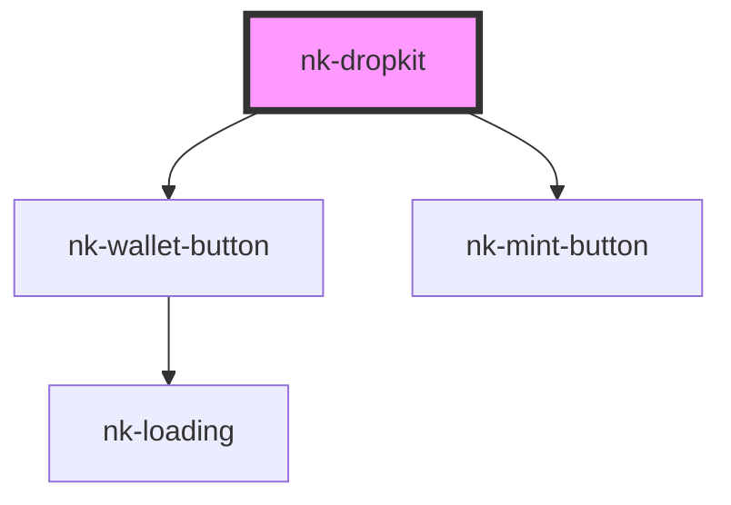

# nk-dropkit

<!-- Auto Generated Below -->

## Properties

| Property              | Attribute     | Description                            | Type      | Default            |
| --------------------- | ------------- | -------------------------------------- | --------- | ------------------ |
| `apikey` _(required)_ | `apikey`      | Drop SDK Key                           | `string`  | `undefined`        |
| `dev`                 | `dev`         | Flag to enable testnet mode            | `boolean` | `false`            |
| `mintText`            | `mint-text`   | Mint Button default text               | `string`  | `'Mint NFT'`       |
| `multiple`            | `multiple`    | Flag to enable multiple wallet support | `boolean` | `true`             |
| `walletText`          | `wallet-text` | Connect Wallet Button default text     | `string`  | `'Connect Wallet'` |

## Events

| Event             | Description | Type                          |
| ----------------- | ----------- | ----------------------------- |
| `minted`          |             | `CustomEvent<DropCollection>` |
| `walletConnected` |             | `CustomEvent<DropCollection>` |

## Dependencies

### Depends on

- [nk-wallet-button](../nk-wallet-button)
- [nk-mint-button](../nk-mint-button)

### Graph

----------------------------------------------

*Built with [StencilJS](https://stenciljs.com/)*
