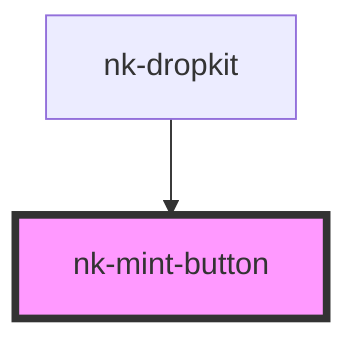

# nk-mint-button

<!-- Auto Generated Below -->

## Properties

| Property                  | Attribute        | Description | Type      | Default      |
| ------------------------- | ---------------- | ----------- | --------- | ------------ |
| `disabled`                | `disabled`       |             | `boolean` | `false`      |
| `loading`                 | `loading`        |             | `boolean` | `false`      |
| `maxPerMint` _(required)_ | `max-per-mint`   |             | `number`  | `undefined`  |
| `placeholder`             | `placeholder`    |             | `string`  | `'Mint NFT'` |
| `selectedValue`           | `selected-value` |             | `number`  | `-1`         |

## Events

| Event           | Description | Type                  |
| --------------- | ----------- | --------------------- |
| `tokensChanged` |             | `CustomEvent<number>` |

## Shadow Parts

| Part                   | Description |
| ---------------------- | ----------- |
| `"mint-btn"`           |             |
| `"mint-btn-container"` |             |
| `"mint-dropdown-icon"` |             |
| `"mint-text"`          |             |

## Dependencies

### Used by

 - [nk-dropkit](../nk-dropkit)

### Graph

----------------------------------------------

*Built with [StencilJS](https://stenciljs.com/)*
