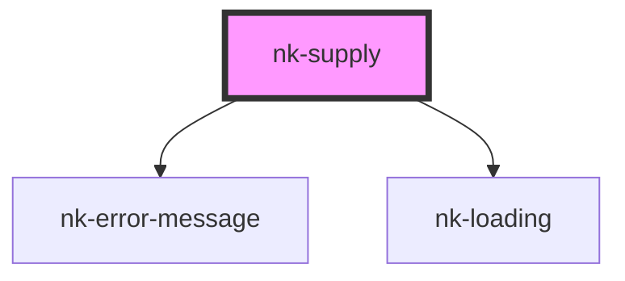

# nk-supply

<!-- Auto Generated Below -->

## Properties

| Property              | Attribute | Description                 | Type      | Default     |
| --------------------- | --------- | --------------------------- | --------- | ----------- |
| `apikey` _(required)_ | `apikey`  | Drop SDK Key                | `string`  | `undefined` |
| `dev`                 | `dev`     | Flag to enable testnet mode | `boolean` | `false`     |

## Shadow Parts

| Part            | Description |
| --------------- | ----------- |
| `"supply-text"` |             |

## Dependencies

### Depends on

- [nk-error-message](../nk-error-message)
- [nk-loading](../nk-loading)

### Graph

----------------------------------------------

*Built with [StencilJS](https://stenciljs.com/)*
