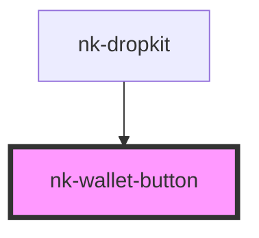

# nk-wallet-button

<!-- Auto Generated Below -->

## Properties

| Property   | Attribute  | Description | Type      | Default |
| ---------- | ---------- | ----------- | --------- | ------- |
| `disabled` | `disabled` |             | `boolean` | `false` |
| `loading`  | `loading`  |             | `boolean` | `false` |

## Shadow Parts

| Part                     | Description |
| ------------------------ | ----------- |
| `"wallet-btn"`           |             |
| `"wallet-btn-container"` |             |

## Dependencies

### Used by

 - [nk-dropkit](../nk-dropkit)

### Graph

----------------------------------------------

*Built with [StencilJS](https://stenciljs.com/)*
