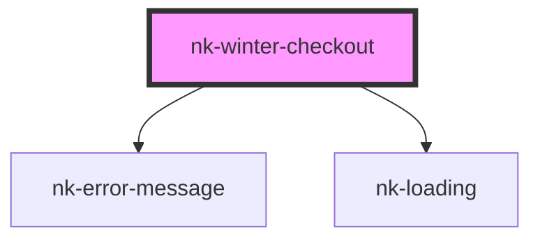

# nk-winter-checkout

<!-- Auto Generated Below -->

## Properties

| Property                 | Attribute           | Description                 | Type      | Default            |
| ------------------------ | ------------------- | --------------------------- | --------- | ------------------ |
| `apikey` _(required)_    | `apikey`            | Drop SDK Key                | `string`  | `undefined`        |
| `brandImage`             | `brand-image`       |                             | `string`  | `null`             |
| `dev`                    | `dev`               | Flag to enable testnet mode | `boolean` | `false`            |
| `email`                  | `email`             |                             | `string`  | `null`             |
| `erc1155Video`           | `erc-1-1-5-5-video` |                             | `string`  | `null`             |
| `mintQuantity`           | `mint-quantity`     |                             | `string`  | `null`             |
| `mintText`               | `mint-text`         |                             | `string`  | `'Mint With Card'` |
| `projectId` _(required)_ | `project-id`        | Winter Project Id           | `string`  | `undefined`        |
| `projectTitle`           | `project-title`     |                             | `string`  | `null`             |
| `walletAddress`          | `wallet-address`    |                             | `string`  | `null`             |

## Events

| Event     | Description | Type                   |
| --------- | ----------- | ---------------------- |
| `close`   |             | `CustomEvent<boolean>` |
| `success` |             | `CustomEvent<any>`     |

## Methods

### `openModal() => Promise<void>`

#### Returns

Type: `Promise<void>`

## Shadow Parts

| Part                     | Description |
| ------------------------ | ----------- |
| `"wallet-btn-container"` |             |
| `"winter-btn"`           |             |

## Dependencies

### Depends on

- [nk-error-message](../nk-error-message)
- [nk-loading](../nk-loading)

### Graph

----------------------------------------------

*Built with [StencilJS](https://stenciljs.com/)*
